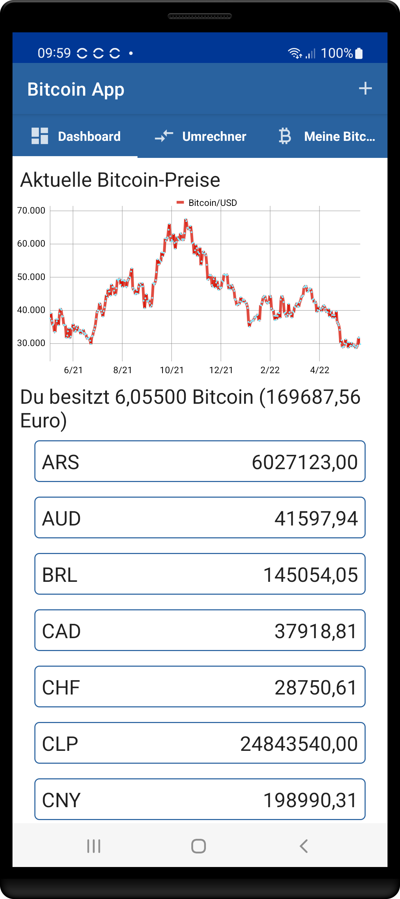

This small app shows the current Bitcoin rates, a Bitcoin currency converter and optionally your own Bitcoin stock. All data are downloaded via the blockchain.info APIs. The app consists of the following three tabs:

- A dashboard that shows the history of the Bitcoin price in USD for the last 12 months and lists the rate in different currencies. You can use the (+) button to enter your own Bitcoin stock, which is then also displayed in the dashboard.

- The converter allows you to convert a Bitcoin amount into five different currencies.

- The My Bitcoins-Tab shows your Bitcoin stock and the corresponding value in Euros.

The communication with the Blockchain API is done via Retrofit and the data are parsed from JSON. The chart was created using the MPAndroidChart library. Dependency injection was done using Hilt/Dagger. View binding and data binding are used as well as MVVM architecture.

 

Screenshots:

